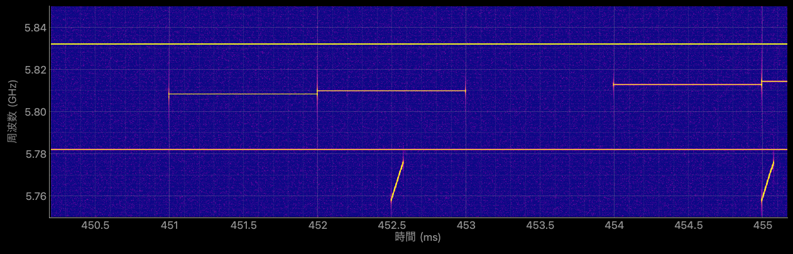

# IQ Analyzer

[](https://github.com/mashi727/iq-analyzer/actions/workflows/ci.yml)
[](https://www.python.org/)
[](LICENSE)

GUI viewer for very large IQ recordings from Rohde & Schwarz and Keysight test
equipment. Explore 100 GB-class captures on commodity hardware (Windows 11,
Core i3, 8 GB RAM) without ever loading the file into RAM.


<sub>合成デモ信号（周波数ホッピング・CW 2 波・パルス LFM レーダー・広帯域バースト、
Fc = 5.8 GHz, 100 MS/s）を表示した例。上から スペクトログラム / Region 内の時間–振幅波形 /
全体波形（Region 選択）。データは [`scripts/generate_demo_iq.py`](scripts/generate_demo_iq.py) で再現できます。</sub>

## 主な機能

- **100 GB 級に対応** — 初回だけ振幅エンベロープ（4096 サンプルごとの最大・最小）を
  バックグラウンドで計算してキャッシュ（100 GB で約 49 MB）。2 回目以降は全体波形も
  ズーム波形も即時表示。121 GB の WVD（外部ドライブ）を開くまで 1.6 秒
- **メモリ一定のスペクトログラム** — Region を分割して読みながら STFT し、時間方向に
  max-pool。Region がどれだけ長くてもメモリ使用量は一定で、1 フレームだけのバーストも消えない
- **4 フォーマット対応** — 同じ UI から透過的に開ける
  - Rohde & Schwarz **WVH / WVD** (RAW16LE)。`X_header.wvh` + `X_data.wvd` のように
    名前が違う組もサイズ一致で自動的に対応付け
  - Rohde & Schwarz **ARB 波形 `.wv`** (SMU-WV, int16 LE の単一ファイル。
    暗号化などでIQとして解釈できないデータは統計的に検出して警告)
  - Rohde & Schwarz **iq.tar** (float32 / float64)
  - Keysight **N5110A `.bin` + `.bin.txt`** (16-bit LE + YScale 自動適用)
- **エクスプローラー風のファイルブラウザ** — 起動フォルダ・ホーム・「この Mac」（Windows は
  「PC」）の下に内蔵/外付け/ネットワークドライブ。ドライブの抜き差しやファイルの追加を自動反映。
  クリックでヘッダー表示、ダブルクリックで読み込み
- **3 ペイン同期 UI**
  - 上段: スペクトログラム (ROI 選択, plasma/viridis/inferno/magma カラーマップ,
    周波数軸は GHz / MHz を自動選択)
  - 中段: Region 内の詳細時間–振幅波形
  - 下段: 全体波形のオーバービュー + 線形 Region セレクタ
- **適応的 STFT パラメータ** — Region の長さから NFFT / overlap / 窓関数を
  自動選択。8 GB マシン向けにメモリ予算 (~4 GB) で頭打ち
- **Min-Max エンベロープ デシメーション** — 全体波形プロットでパルス信号の
  ピークを保持
- **ログパネル** — 標準出力に加えて、エラー出力・警告・ログを赤字で表示
  （コンソールの無い Windows の EXE でもエラーを確認できる）
- **WVH/WVD 形式での書き出し** — Region 範囲をいつでも切り出せる (iq.tar /
  Keysight からの変換も対応)

## 拡大表示の例



<sub>上のデモ信号の 5 ms 区間。80 µs・18 MHz 掃引のチャープパルス、1 ms 滞留の周波数ホッピング、
2 本の CW が分解できる。</sub>

## インストール (uv)

[uv](https://docs.astral.sh/uv/) を入れていれば一発で起動できます:

```bash
git clone https://github.com/mashi727/iq-analyzer.git
cd iq-analyzer
uv sync          # Python 3.12 + 全依存関係を解決
uv run iq-analyzer
```

(pip / Poetry の場合: `pyproject.toml` を直接 `pip install -e .[build]`)

### 依存パッケージ

- **PySide6** ≥ 6.6 — Qt バインディング
- **pyqtgraph** ≥ 0.13 — 高速プロット
- **numpy** ≥ 1.26, **scipy** ≥ 1.11 — 信号処理
- **psutil** ≥ 5.9 — メモリ使用量表示
- **pyqtdarktheme** ≥ 2.1 — ダークテーマ (任意)

## 使い方

1. 左ペインのファイルブラウザから IQ ファイルをダブルクリックで開く
   (`.wvh`, `.wvd`, `.wv`, `.iq.tar`, または `.bin.txt` を伴う `.bin`)。
   外部ストレージは「この Mac」（Windows では「PC」）の下に並ぶ
2. 下段の Overview で青い線形 Region をドラッグして関心範囲を選択
3. **📊 スペクトログラム計算** ボタン (or 「Region 変更時に自動更新」 ON) で
   2D スペクトログラムを描画
4. 右側パネルで cmap / NFFT / overlap / 下位カットオフを微調整
5. **💾 保存** で Region 範囲を WVH/WVD に書き出し

### デモデータで試す

R&S や Keysight の実機データが無くても、合成データで一通り試せます。

```bash
uv run python scripts/generate_demo_iq.py            # demo_data/ に 400 MB の WVH/WVD を生成
uv run python scripts/generate_demo_iq.py --seconds 5  # 長くしたい場合（2 GB）
```

起動後、ファイルブラウザで `demo_data/demo_capture.wvh` をダブルクリックしてください。

### 起動方法のバリエーション

```bash
uv run iq-analyzer           # インストール済みエントリポイント
python -m iq_analyzer        # モジュール実行
python rs_iq_viewer.py       # 旧スクリプト (後方互換 shim)
```

## パッケージ構造

```
src/iq_analyzer/
├── cli.py                 # QApplication 起動 + main()
├── core/
│   ├── decimation.py      # Min-Max エンベロープ / プレビュー
│   ├── envelope.py        # 振幅エンベロープのキャッシュ（100 GB 級向け）
│   ├── memory.py          # メモリ監視 / 色閾値
│   ├── spectrogram.py     # STFT（分割計算 + 時間方向 max-pool）
│   └── stdout_redirector.py
├── loaders/
│   ├── base.py            # IQLoader Protocol
│   ├── wv.py              # R&S WVH/WVD
│   ├── smuwv.py           # R&S ARB 波形 .wv (SMU-WV)
│   ├── iqtar.py           # R&S iq.tar
│   └── keysight.py        # Keysight N5110A .bin
├── widgets/
│   ├── spectrogram.py     # SpectrogramWidget + max_pool_2d
│   ├── file_browser.py    # FileBrowserPanel（ドライブ一覧つきツリー + プレビュー）
│   ├── control_panel.py   # トップバー (計算/保存/終了)
│   └── adjustment_panel.py # 表示設定
└── ui/
    ├── main_window.py     # RSIQViewer (3 プロット同期)
    └── envelope_worker.py # エンベロープ構築スレッド
scripts/generate_demo_iq.py  # 合成デモデータの生成
```

## 開発

```bash
uv sync                       # dev 依存関係込みでセットアップ
uv run pytest -q              # 100 ケース、4 秒程度
uv run ruff check .           # lint
uv run ruff check --fix .     # auto-fix
```

詳細は [CONTRIBUTING.md](CONTRIBUTING.md) を参照。

## パフォーマンス目標 (検証環境: macOS, Apple Silicon)

| シナリオ                                  | 起動時間 | ピーク RAM |
|-------------------------------------------|---------|-----------|
| WVD 250 MB (65 M samples)                 | < 1 s   | ~450 MB   |
| iq.tar 2 GB (250 M samples, float32)      | < 2 s   | ~680 MB   |
| Keysight 850 MB (223 M samples @ 2.4 GSa/s, Fc=10 GHz) | < 2 s   | ~600 MB   |
| Region 50% でのスペクトログラム計算       | < 10 s  | ~2.5 GB   |
| WVD 121 GB（外部ドライブ, 303 億サンプル）初回 | 1.6 s（全体波形の構築は裏で約 5 分） | 未計測 |
| 同 2 回目以降（エンベロープキャッシュ使用） | < 0.3 s | — |

## License

[MIT](LICENSE) © 2025 MASAMI Mashino
