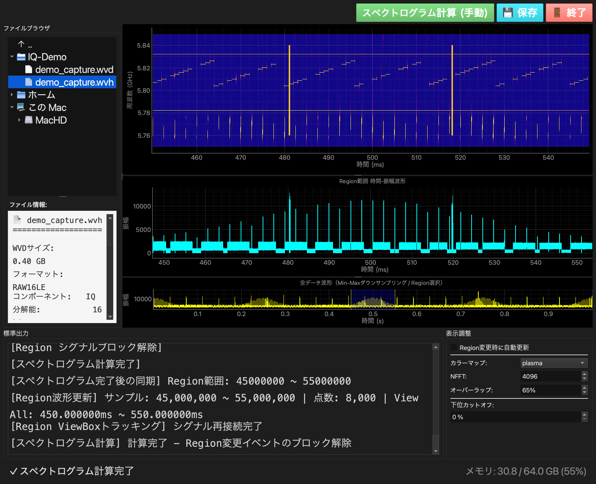

# IQ Analyzer

[](https://github.com/mashi727/iq-analyzer/actions/workflows/ci.yml)
[](https://www.python.org/)
[](LICENSE)

**計測器で記録した電波の生データ（IQ データ）を、100 GB 級の大きさでも普通の PC で開いて、
見て・拡大して・音で聴くためのデスクトップアプリです。**
Rohde & Schwarz と Keysight の計測器が出力するファイルに対応しています。



<sub>合成デモ信号（周波数ホッピング・連続波 2 本・パルス信号・広帯域バースト）を表示した例。
上から スペクトログラム / 選択範囲の波形 / ファイル全体の波形。
データは [`scripts/generate_demo_iq.py`](scripts/generate_demo_iq.py) で誰でも再現できます。</sub>

---

## これは何をするツールか

電波を計測器で記録すると、**IQ データ**と呼ばれる数値の列ができます。1 秒間に数億回、
電波の振幅と位相を測った値です。サンプリング周波数 250 MHz なら 1 秒で約 1 GB、
1 分強で 100 GB を超えます。普通の波形ビューアやスクリプトでは、メモリに載らず開けません。

IQ Analyzer は、このような巨大なファイルを**メモリに読み込まずに**扱い、次のことができます。

| やりたいこと | このツールでできること |
|---|---|
| 全体をざっと見たい | 100 GB のファイルでも、全体の波形を 2 秒以内に表示し、拡大・移動できる |
| どの時刻にどの周波数が出ているか見たい | 選んだ範囲の**スペクトログラム**（時間 × 周波数の強さの図）を描く |
| 信号を耳で確かめたい | スペクトログラム上で囲んだ範囲を**音に変えて再生**する |
| 一部だけ取り出したい | 選んだ範囲を WVH/WVD 形式で切り出して保存する |

目標とする動作環境は Windows 11・Core i3・メモリ 8 GB です（macOS でも動きます）。

## 最低限の用語

| 用語 | 意味 |
|---|---|
| IQ データ | 電波を複素数（I = 実部、Q = 虚部）で記録したもの。振幅と位相の両方が分かる |
| サンプリング周波数 | 1 秒間に何回測ったか。250 MHz なら 1 秒に 2 億 5 千万点 |
| スペクトログラム | 横軸が時間、縦軸が周波数、色が強さの図。「いつ、どの周波数に、どれだけ」が一目で分かる |
| 包絡線 | 信号の強さの変化だけを取り出した曲線。パルス（短い電波）なら「オン・オフ」の形になる |
| PRF | パルスが 1 秒に何回繰り返されるか。2,500 回なら 2.5 kHz |

---

## できること

### 1. 巨大なファイルを開いて全体を見る

- 左のファイルブラウザでファイルをダブルクリックするだけで開けます。外付けドライブも一覧に出ます。
  1 回クリックすると、ファイルの情報（サンプル数、サンプリング周波数、記録時間など）が表で出ます。
- **初回だけ**、裏で「4096 点ごとの最大値と最小値」を計算して保存します（100 GB のファイルで約 49 MB）。
  2 回目からは、ファイル全体の波形もズームした波形も即座に出ます。
  計算中も操作でき、短いパルスが間引きで消えることもありません。
- 実測：121 GB のファイル（外付けドライブ）を開いて最初の表示まで 1.6 秒、2 回目以降は 0.3 秒未満。

### 2. スペクトログラムで時間と周波数を同時に見る

- 下段の全体波形で青い範囲（Region）をドラッグして選び、**スペクトログラム計算**を押します。
- 範囲がどれだけ長くても、少しずつ読んで計算するのでメモリ使用量は一定です。
  1 回しか出ない短いバーストも、表示の縮小で消えないようにしています。

### 3. 選んだ範囲を音で聴く（▶ 包絡線を再生）

- スペクトログラム上の水色の枠で「時間 × 周波数」の範囲を囲みます。右下と各辺の中点のハンドルで大きさを変えられます。
- 再生ボタンを押すと、枠の周波数帯だけを取り出して、その**包絡線**を音にします。
  たとえば PRF 2.5 kHz のパルス列は、2,500 Hz の音として聞こえます。
- 速度は 4 倍速から 1/1000 まで変えられます。遅くすると音も低くなり、細かい変化を聞き取れます。
  再生中はスペクトログラム上に再生位置の線が動きます。ループ再生と WAV 保存もできます。

### その他

- 選択範囲を WVH/WVD 形式で切り出して保存（iq.tar や Keysight 形式からの変換を含む）
- エラーや警告を画面下のログ欄に赤字で表示（コンソールのない Windows 版でも確認できる）
- 黒基調のフラットな画面。ボタンは役割ごとに色をそろえています（緑＝実行、青緑＝保存、赤＝停止）

---

## 使い方（基本の流れ）

1. 左のファイルブラウザで IQ ファイルをダブルクリックして開く
2. 下段の全体波形で、青い範囲（Region）をドラッグして見たい所を選ぶ
3. **📊 スペクトログラム計算** を押す（「Region 変更時に自動更新」を ON にすれば自動）
4. 気になる信号を水色の枠で囲み、**▶ 包絡線を再生** で聴く
5. 必要なら **💾 保存** で選択範囲を切り出す

## インストール

[uv](https://docs.astral.sh/uv/) があれば次の 4 行で起動できます。

```bash
git clone https://github.com/mashi727/iq-analyzer.git
cd iq-analyzer
uv sync          # Python と依存パッケージをまとめて用意
uv run iq-analyzer
```

pip を使う場合は `pip install -e .` でも入ります。
依存パッケージは PySide6（画面）、pyqtgraph（グラフ）、numpy・scipy（計算）、psutil（メモリ表示）です。

### 計測器のデータが無くても試せます

```bash
uv run python scripts/generate_demo_iq.py              # demo_data/ に 400 MB の合成データを作る
uv run python scripts/generate_demo_iq.py --seconds 5  # もっと長く（2 GB）
```

起動後、ファイルブラウザで `demo_data/demo_capture.wvh` をダブルクリックしてください。

### 対応ファイル形式

| メーカー | 形式 | 拡張子 |
|---|---|---|
| Rohde & Schwarz | IQ 記録（16 bit 整数） | `.wvh` + `.wvd`（名前が違う組もサイズで自動的に対応付け） |
| Rohde & Schwarz | 信号発生器用の波形 | `.wv`（暗号化などで IQ として読めないデータは検出して警告） |
| Rohde & Schwarz | IQ-TAR（32/64 bit 浮動小数点） | `.iq.tar` |
| Keysight | N5110A | `.bin` + `.bin.txt` |

---

## 仕組みのポイント（興味のある人向け）

- **メモリに読み込まない**：ファイルは必要な部分だけを読みます（メモリマップと逐次読み込み）。
  全体波形の要約（4096 点ごとの最大・最小）はユーザーのキャッシュフォルダに保存し、
  データの隣（外付けドライブや同期フォルダ）には書きません。
- **短い信号を消さない**：全体波形は区間ごとの最大・最小で描き、スペクトログラムは時間方向に最大値で
  縮めるので、1 回だけの短いパルスも表示から消えません。
- **包絡線の作り方**：IQ データはもともと複素数（解析信号）なので、選んだ帯域だけを FFT で取り出して
  逆変換し、その絶対値を取れば包絡線（ヒルベルト包絡）になります。長い範囲はブロックに分け、
  境目の影響を捨てながら（オーバーラップ破棄法）つなぎます。音にするときは、音声 1 サンプルの区間内の
  最大値を採る「ピーク検波」が既定で、数 µs の短いパルスも欠けずにクリック音になります。
- **外付けドライブで遅くならない工夫**：同じドライブの離れた位置を 2 か所同時に読むと極端に遅くなるため、
  裏の要約計算は、表で大量に読む間だけ一時停止します。

## 処理時間とメモリの目安（macOS, Apple Silicon で計測）

| シナリオ | 時間 | ピークメモリ |
|---|---|---|
| WVD 250 MB を開く | < 1 秒 | ~450 MB |
| iq.tar 2 GB を開く | < 2 秒 | ~680 MB |
| Keysight 850 MB を開く | < 2 秒 | ~600 MB |
| Region 50% のスペクトログラム | < 10 秒 | ~2.5 GB |
| WVD 121 GB（外付けドライブ）を開く、初回 | 1.6 秒（全体の要約は裏で約 5 分） | 未計測 |
| 同、2 回目以降 | < 0.3 秒 | — |

---

## 開発者向け

```bash
uv sync                    # 開発用の依存も含めて用意
uv run pytest -q           # テスト（108 件、数秒）
uv run ruff check .        # lint（--fix で自動修正）
```

起動方法は `uv run iq-analyzer` のほか、`python -m iq_analyzer`、`python rs_iq_viewer.py`（旧スクリプト）でも可能です。
詳しくは [CONTRIBUTING.md](CONTRIBUTING.md) を参照してください。

<details>
<summary>パッケージ構造</summary>

```
src/iq_analyzer/
├── cli.py                 # 起動処理（テーマ適用 + メイン画面）
├── core/                  # 画面に依存しない計算
│   ├── envelope.py        # 全体波形の要約（4096 点ごとの最大・最小）とキャッシュ
│   ├── decimation.py      # 表示用の間引き（ピークを保持）
│   ├── spectrogram.py     # スペクトログラム（分割計算）
│   ├── audio.py           # 選択範囲の包絡線の音声化
│   ├── memory.py          # メモリ監視
│   └── stdout_redirector.py
├── loaders/               # ファイル形式ごとの読み込み
│   ├── base.py            # 共通インターフェース
│   ├── wv.py              # R&S WVH/WVD
│   ├── smuwv.py           # R&S .wv
│   ├── iqtar.py           # R&S iq.tar
│   └── keysight.py        # Keysight .bin
├── widgets/               # 画面部品
│   ├── spectrogram.py     # スペクトログラム（選択枠・再生位置）
│   ├── file_browser.py    # ファイルブラウザ
│   ├── control_panel.py   # 上部のボタン
│   ├── adjustment_panel.py # 表示設定
│   └── envelope_audio.py  # 包絡線の再生
└── ui/
    ├── main_window.py     # メイン画面
    ├── style.py           # 黒基調のテーマと共通ボタン
    └── envelope_worker.py # 全体波形の要約を作るスレッド
scripts/generate_demo_iq.py  # 合成デモデータの生成
```

</details>

## License

[MIT](LICENSE) © 2025 MASAMI Mashino
